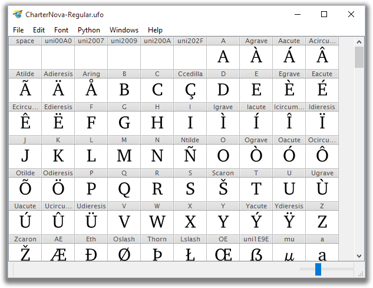

# TruFont

TruFont is a font-editing application written with Python3, ufoLib, defcon and PyQt.

## Dependencies

- Python 3
- PyQt5
- cython & [booleanOperations]
- [fontTools]
- [robofab, python3-ufo3 branch]
- [defcon, python3-ufo3 branch]

Optional:

- [extractor, python3-ufo3 branch]
- [ufo2fdk, python3-ufo3 branch]

## Run

Install: `python setup.py install && trufont`

Virtualenv: `cd Lib && python -m defconQt`

## Install notes

- On OSX, it is highly recommended to install all dependencies with [Homebrew]
  in order to have a correct Qt namespace (`brew` handles it all by itself).  
  Finish with `brew linkapps python3` to be able to call `python3` from the
  Terminal.
- You can have multiple versions of Python on your system, then you just need to
  use a version prefix, e.g.:
  * `python3`
  * `python3.4`
  * `python3.5`
  * …

[booleanOperations]: https://github.com/typemytype/booleanOperations
[fontTools]: https://github.com/behdad/fonttools
[robofab, python3-ufo3 branch]: https://github.com/trufont/robofab
[defcon, python3-ufo3 branch]: https://github.com/trufont/defcon
[extractor, python3-ufo3 branch]: https://github.com/trufont/extractor
[ufo2fdk, python3-ufo3 branch]: https://github.com/trufont/ufo2fdk
[Homebrew]: http://brew.sh/
