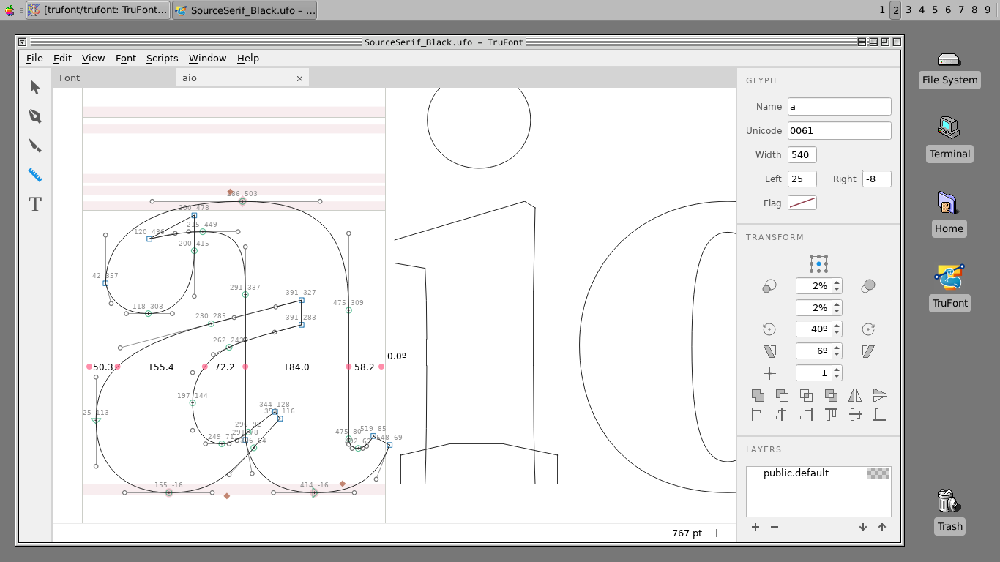

|Build Status|

TruFont
=======

`TruFont <https://trufont.github.io>`__ is a font-editing application
written with Python3, ufoLib, defcon, and PyQt5.

Getting started
===============

Quick installation instructions
-------------------------------

If you have Python3 and Git installed and want to quickly install 
and run TruFont in a virtual environment, open a terminal and enter 
the following chain of commands as one line:

``python3 -m venv trufont-venv && source trufont-venv/bin/activate && cd trufont-venv && git clone https://github.com/trufont/trufont.git && cd trufont && pip install --upgrade -r requirements.txt && pip install --editable . && trufont``

Or, as separate lines, making modifications when needed:

   .. code::

      python3 -m venv trufont-venv
      source trufont-venv/bin/activate
      cd trufont-venv
      git clone https://github.com/trufont/trufont.git
      cd trufont &&
      pip install --upgrade -r requirements.txt
      pip install --editable .
      trufont``

Detailed Installation Instructions
----------------------------------

1. Install **Python 3.5** (or later):

   -  OS X: Install using `Homebrew <http://brew.sh/>`__:
      ``brew install python3``
   -  Windows: Download installer from 
      `python.org/downloads <https://www.python.org/downloads/>`__
   -  Linux: It's usually packaged with the OS,
      run ``python3 --version`` to see what you have installed. 

2. Install **Git 2.1** (or later):

   -  OS X: Install using `Homebrew <http://brew.sh/>`__:
      ``brew install git``
   -  Windows: Download installer from 
      `https://git-scm.com/download/win <https://git-scm.com/download/win>`__
   -  Ubuntu/Debian Linux, run: ``apt install git``
   -  Arch Linux, run: ``pacman -Syu git``

3. Set up a new Python **virtual environment**. Although this is not
   required, it’s *highly recommended*, since TruFont has lots of
   dependencies, which may (or may not) conflict with other modules
   you installed globally.

   -  To create a new virtual environment, run the following command:

      ``python3 -m venv TRUFONT-VENV``

      This creates a new ``TRUFONT-VENV`` folder (you can choose the name 
      you want). The ``bin`` subfolder (or ``Scripts`` if you are 
      on Windows) contains a new ``python`` executable, and the 
      ``pip`` installer linked to that.

   -  Activate the newly created environment:

      -  OS X or Linux: ``source TRUFONT-VENV/bin/activate``
      -  Windows: ``TRUFONT-VENV\Scripts\activate.bat``
      -  Fish: ``source TRUFONT-VENV/bin/activate.fish``

      This temporarily adds the virtual environment’s scripts folder to
      your console’s `PATH`, so you can access ``python``, ``pip`` and
      the ``trufont`` script from anywhere. Use ``pip list`` to see what 
      you have installed.

   -  Run ``deactivate`` when you wish to exit the virtual environment.
      This restores the default system `PATH`.

4. With the ``venv`` activated, clone the TruFont repository. You can put 
   it wherever you like, but for this example, we will just place it in 
   ``TRUFONT-VENV``:

   .. code::

      cd TRUFONT-VENV
      git clone https://github.com/trufont/trufont.git

5. Move into the directory you just cloned from GitHub and run the following
   command to install TruFont and the requiered dependancies:

   ``pip install --upgrade -r requirements.txt && pip install --editable .``

   If you get an error, look to see if it was caused by an outdated dependency, 
   then use ``pip`` to update to the latest version. For example, if ``ufoLib`` 
   is causing an error, run:

   ``pip install --upgrade ufolib``

6. Finally, run TruFont with:

   ``trufont``

   **TruFont** is now installed! This installation method makes TruFont editable,
   so if you make a change to the source code, that change will take effect 
   next time you launch TruFont, without needing to reinstall.

Contributing
============

Here's a quick tutorial if you'd like to contribute to TruFont.

1. Click the "Fork" button above, and clone the forked git repository
   to a new directory called ``trufont``:

   ``git clone https://github.com/<YOUR_USERNAME>/trufont``

2. Move into the new folder and run this command to add the upstream
   repository url to the local list of remotes:

   ``git remote add upstream https://github.com/trufont/trufont``

   This enables you to keep up-to-date with the upstream development.

4. Synchronize your fork's `master` branch with the
   ``upstream/master``, especially before creating new branches:

   .. code::

      git checkout master
      git fetch upstream
      git rebase upstream/master
      git push

5. Now, you can create and checkout your new feature branch:

   ``git checkout -b my-cool-new-feature``

6. Use pip to install TruFont in "editable" mode:

   ``pip install --editable .``

   Instead of copying `trufont` to your Python site-packages directory,
   this command only creates a link to the source directory inside the
   git repository. You can then modify the code in place, or 
   synchronize the latest upstream changes (as in step 4) without
   having to re-install.

7. It is also recommended to regularly update the dependencies to the
   curently tested versions as listed in `requirements.txt`:

   ``pip install --upgrade -r requirements.txt``

8. Once you have commited your patch, push the new branch to your fork:

   ``git push -u origin my-cool-new-feature``

9. Finally, click "New pull request" on TruFont's Github page to submit
   your patch.

We will be happy to review and integrate it into the main app.

Happy hacking with TruFont! :muscle:

.. |Build Status| image:: https://travis-ci.org/trufont/trufont.svg?branch=master
   :target: https://travis-ci.org/trufont/trufont
